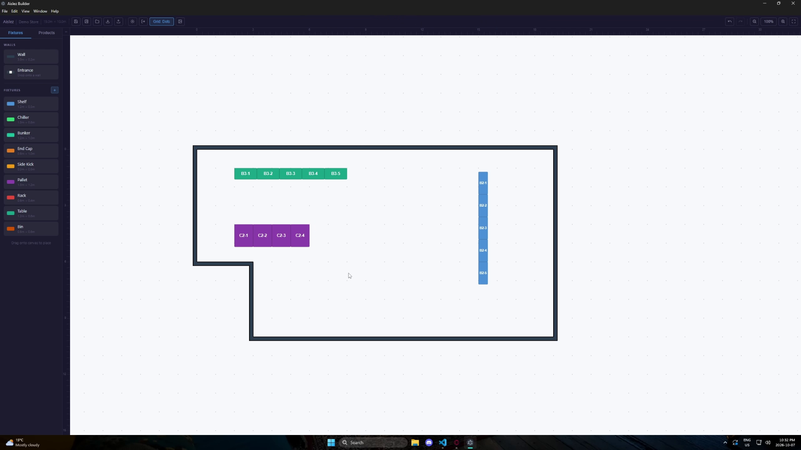
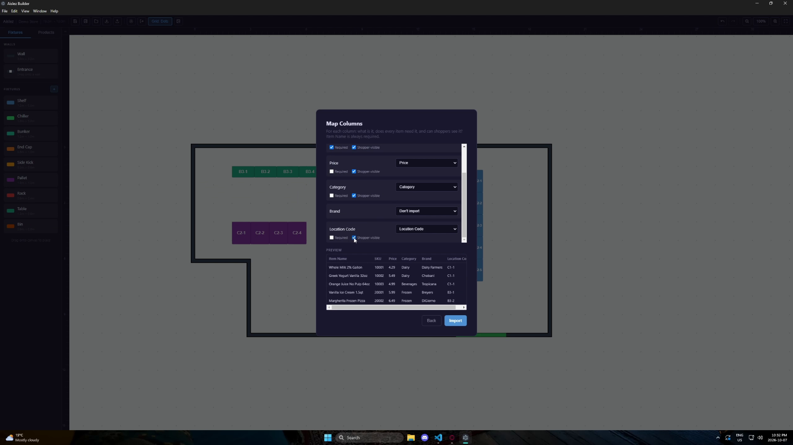
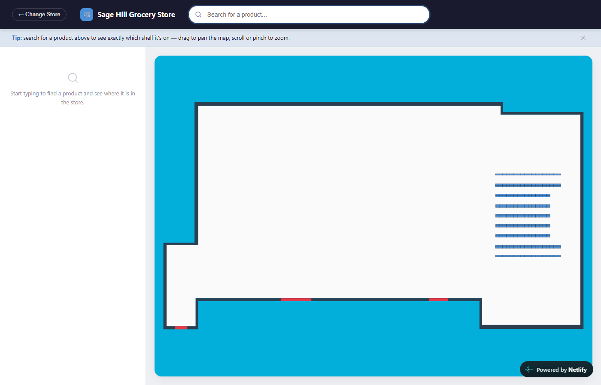
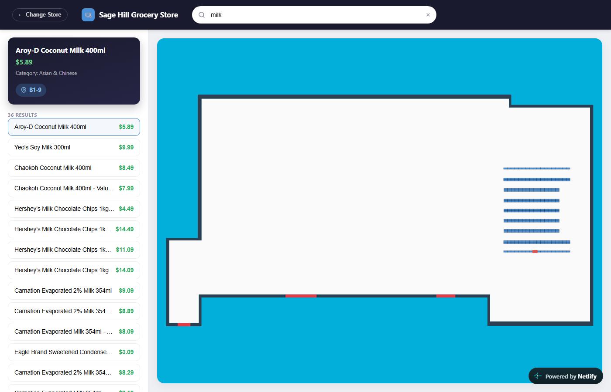

# Aislez

A retail in-store navigation platform — map a store once, let any shopper find any product in it.

**The problem:** finding one specific item in a large store is slow and frustrating, and the usual fallback — wandering the aisles or flagging down staff — doesn't scale. Store layouts also change constantly (a shelf gets rearranged, a new aisle opens), so even when a printed store map exists, it's usually already out of date the moment it's printed.

**What Aislez does:** it's two connected apps. **Builder** is a desktop app a retailer uses to draw their store's floor plan, place shelves and fixtures, assign them aisle/bay location codes, and import their product catalog from a CSV — matching each product to its exact fixture automatically by location code. **Shopper** is the customer-facing web app: type a product name, see exactly where it is on a live map of the actual store, highlighted. The two connect through a single exported JSON file — no server, no database, no backend at all — so a retailer's store data never has to leave their own hands.

## Demo

[](https://raw.githubusercontent.com/AXP4/Aislez/main/docs/builder-demo.mp4)

**[▶ Watch the demo (59s)](https://raw.githubusercontent.com/AXP4/Aislez/main/docs/builder-demo.mp4)** — sketching a store outline, placing and coding fixtures, importing a product CSV, and exporting the data package Shopper loads.

**Try it yourself:**
- 🔎 **[Shopper — live demo](https://aislez-shopper.netlify.app)** — opens straight in your browser, no install
- 🖥️ **[Builder — download for Windows](https://github.com/AXP4/Aislez/releases/latest)** — portable `.exe`, no installer or admin rights needed

### Screenshots

<table>
<tr>
<td width="50%">

<p align="center"><sub>Builder — fixtures placed and location-coded on the store outline</sub></p>
</td>
<td width="50%">

<p align="center"><sub>Builder — mapping a retailer's CSV columns, per-field required/shopper-visible settings</sub></p>
</td>
</tr>
<tr>
<td width="50%">

<p align="center"><sub>Shopper — the live store map</sub></p>
</td>
<td width="50%">

<p align="center"><sub>Shopper — search result highlighting the exact shelf</sub></p>
</td>
</tr>
</table>

## Tech stack

**Builder** — Electron, React, TypeScript, Zustand, Konva (`react-konva`) for the canvas, bundled with `electron-vite`, packaged with `electron-builder`.

**Shopper** — React, TypeScript, Vite, plain Canvas 2D (no rendering library — it's read-only, so none of Builder's drag/edit machinery is needed).

No backend, no database, on either side. The two apps share no code — they're connected only by the JSON file Builder exports and Shopper loads.

## Run locally

### Builder (desktop app)
```bash
cd aislez-builder
npm install
npm run dev
```

### Shopper (browser app)
```bash
cd aislez-shopper
npm install
npm run dev
```
Opens at `http://localhost:5173`. Pick "View Demo Store" to load the bundled sample store, or "Upload a Store File" to load any `datapackage.json` exported from Builder.

## License

MIT — see [LICENSE](LICENSE).
